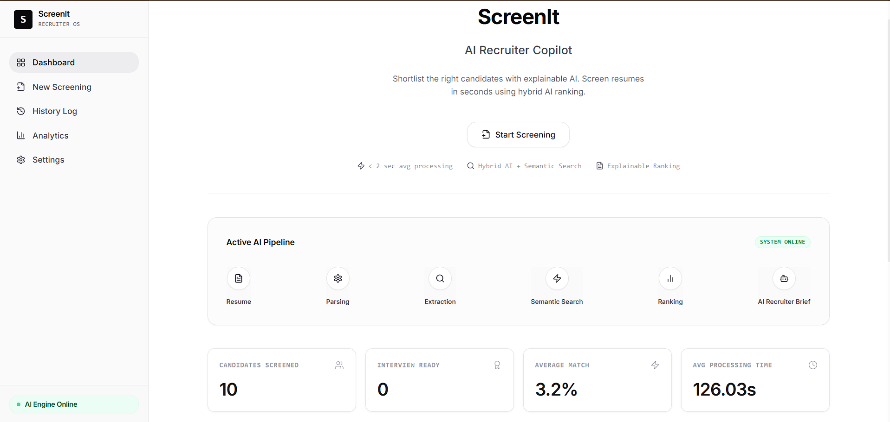
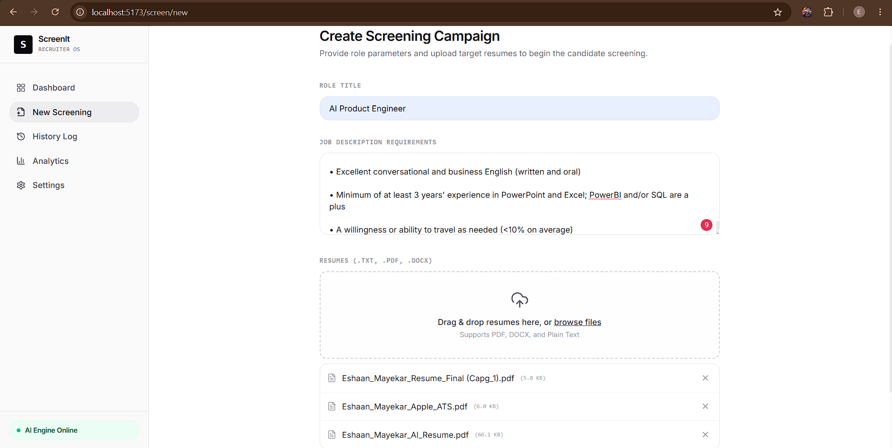
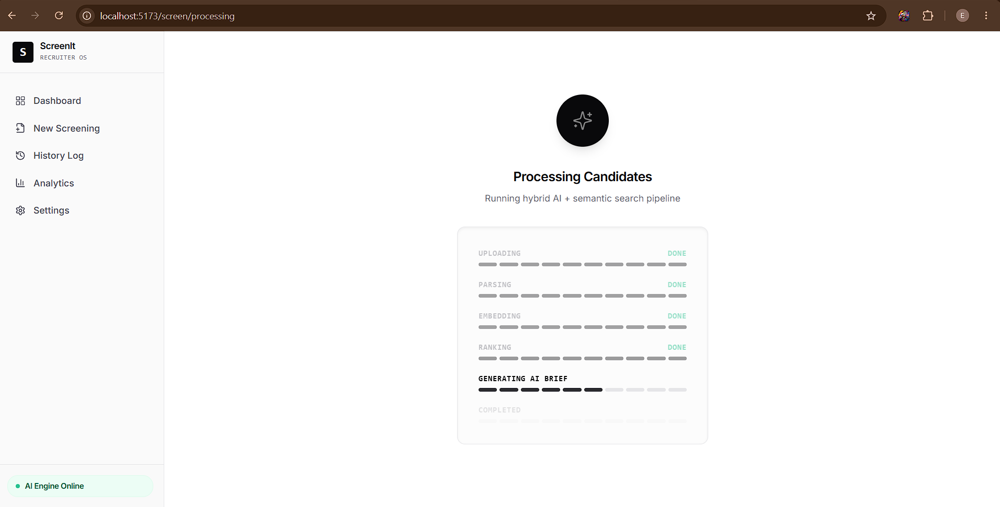
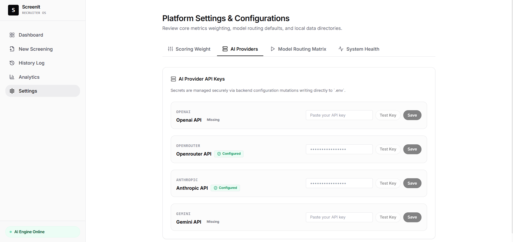
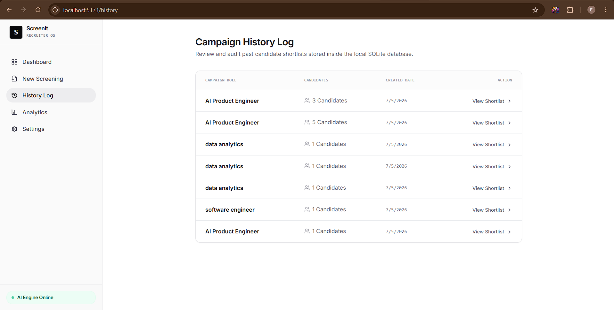
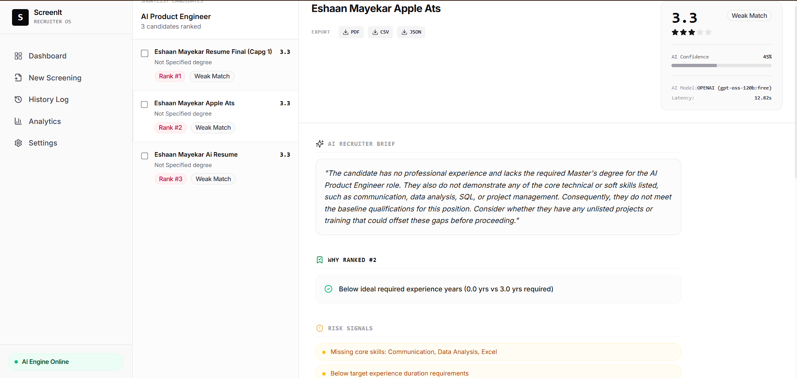

# ScreenIt

---

### 🏆 Rooman Technologies – 24-Hour AI Agent Challenge
* **Category:** Category 1 – People & HR
* **Selected Agent:** Resume Screening Agent
* **Project Name:** ScreenIT – AI Resume Screening Platform

---



### AI Recruiter Copilot

Explainable AI Resume Screening Platform

⭐ Semantic Ranking  
⭐ Hybrid AI Routing  
⭐ Explainable Recommendations  
⭐ Recruiter Analytics  
⭐ Interview Guidance  

---

## What is ScreenIt?

### Problem Statement

Recruiters often receive hundreds of resumes for a single position.

Traditional ATS systems rely heavily on keyword matching, causing qualified candidates to be overlooked and making screening slow and inconsistent.

### Solution

ScreenIt solves this by combining semantic understanding, structured resume parsing, explainable ranking, and AI-generated recruiter insights to help hiring teams make faster and more confident hiring decisions.

```text
Recruiter
   ↓
Upload Job Description
   ↓
Upload Resumes
   ↓
Resume Parsing
   ↓
Semantic Ranking
   ↓
Recruiter Brief
   ↓
Shortlist
   ↓
Export
```

---

## Features

- **Semantic Ranking:** Contextual understanding of experience over rigid keyword checks.
- **Hybrid AI Routing:** Smart failover between Qwen3, GPT-OSS, and Llama 3.3.
- **Explainable Recommendations:** Transparent "Why Ranked" metrics and confidence scores.
- **Recruiter Analytics:** Rich hiring insights directly from the candidate pool.
- **Interview Guidance:** Custom interview questions generated based on candidates' specific skill gaps.

---

## Demo

*(Placeholder for 90-second Demo GIF showing the workflow)*


---

## Architecture


```text
React (Vite, Tailwind, Zustand)
   ↓
FastAPI (REST Endpoints)
   ↓
AI Engine (Orchestration)
   ↓
SentenceTransformer (Local Embeddings)
   ↓
OpenRouter (Multi-Model LLM)
   ↓
SQLite (Persistence)
```

---

## AI Pipeline


```text
Resume
   ↓
Parser
   ↓
Feature Extraction
   ↓
Embedding
   ↓
Similarity
   ↓
Ranking
   ↓
Recruiter Brief
   ↓
Interview Questions
   ↓
Reports
```

---

## Screenshots & Platform Tour

| 🖥️ Dashboard Page | 📂 Start New Screening |
| :---: | :---: |
|  |  |
| **⚡ Resume Parsing Progress** | **⚙️ AI Provider & Routing Settings** |
|  |  |
| **🗒️ Campaign History Log** | **🔍 Scored Candidate Assessment** |
|  |  |

---

## Tech Stack

- **Frontend:** React 19, TypeScript, Vite, Tailwind CSS v4, Zustand, TanStack Query.
- **Backend:** FastAPI, Python 3.13, Pydantic, SQLAlchemy.
- **AI/ML:** SentenceTransformers (`all-MiniLM-L6-v2`), PyMuPDF, OpenRouter API.
- **Database:** SQLite.

---

## Folder Structure

```text
ScreenIt/
├── apps/
│   └── web/                 # React Frontend
├── backend/
│   ├── app/
│   │   ├── ai/              # AI Pipeline Modules
│   │   ├── api/             # FastAPI Routes
│   │   ├── db/              # Database Configuration
│   │   ├── services/        # Orchestration Services
│   │   └── core/            # Config & Settings
│   └── main.py              # Application Entrypoint
├── shared/                  # Schemas & Prompts
├── docs/                    # Diagrams & Media
├── sample_data/             # Resumes & JDs for testing
├── start.bat                # Unified Launcher
├── LICENSE                  # MIT License
└── README.md                # Documentation
```

---

## Installation

1. **Clone the repository**

```bash
git clone https://github.com/AiEshaan/ScreenIT.git
cd ScreenIT
```

2. **Configure Environment**
Create `.env` in the root:

```env
OPENROUTER_API_KEY=your_api_key_here
```
*(All provider keys and routing default configurations are managed dynamically through the platform Settings UI and stored locally).*

---

## Quick Start

Launch the entire stack using the root launcher:

```bash
./start.bat
```

- **Frontend:** `http://localhost:5173`
- **Backend APIs:** `http://localhost:8000/docs`

The platform will run in production mode connecting directly to the FastAPI server and your local SQLite database.

---

## API Endpoints

```http
POST   /api/screen                  # Create campaign and parse resumes
GET    /api/runs                    # Get all campaigns
GET    /api/runs/{id}               # Get detailed campaign report
DELETE /api/runs/{id}               # Delete campaign run and candidates (cascade)
DELETE /api/candidates/{id}         # Delete candidate profile
PATCH  /api/candidates/{id}         # Update candidate metadata or brief
GET    /api/analytics               # Get dynamic database analytics
GET    /api/settings/models         # Fetch active OpenRouter models (free vs paid)
GET    /api/settings/keys           # Get provider keys configuration status
POST   /api/settings/keys           # Save custom provider API key to .env
GET    /api/settings/routing        # Retrieve task cascade orders
POST   /api/settings/routing        # Update task routing priorities
POST   /api/settings/test-key       # Validate provider API credentials
GET    /api/settings/health         # Get database & embedding statuses
```

---

## Model Routing Strategy & Resiliency

The system uses a **Cascading AI Orchestrator** to route tasks to priority models via OpenRouter:

- **Grouped Model Configurations**: Choose dynamically between free-tier models and paid models (GPT-4o Mini, Claude 3 Haiku, Gemini 2.5 Flash) directly in the UI.
- **429 Rate Limit Recovery**: Implements an automatic exponential backoff retry loop (sleeps 2s/4s) when hitting OpenRouter free tier rate limits before failing over to the next priority.
- **Offline Rule Engine**: If all configured cascade models fail, it falls back to a deterministic offline parser and scoring system to complete the task successfully.

---

## Explainability

Every recommendation includes:

- Semantic Similarity Match (Local vector match)
- Skill Match (Direct keyword intersection)
- Experience Match (Required years vs candidate years)
- Education Match (Degree hierarchy validation)
- Why Ranked (AI justification)
- Recruiter Brief (Executive summary)
- AI Confidence & Model telemetry metadata (Model used + Latency)

This allows recruiters to **trust AI recommendations** rather than treating them as a black box.

---

## Engineering Decisions

| Decision            | Why                        |
| ------------------- | -------------------------- |
| **FastAPI**         | Lightweight REST framework |
| **SentenceTransformer** | Offline semantic matching  |
| **OpenRouter**      | Multi-model routing        |
| **SQLite**          | Simple deployment          |
| **React**           | Modern SPA                 |
| **Zustand**         | Lightweight global state   |
| **TanStack Query**  | Smart caching              |
| **Tailwind**        | Fast UI development        |

---

## Tradeoffs

- **SQLite instead of PostgreSQL:** Chosen for zero-setup portability. SQLAlchemy makes swapping to Postgres trivial for production.
- **Synchronous API vs Background Queue:** Currently blocks the HTTP request for simplicity in assessment environments. Production would implement Celery/Redis with WebSocket updates.
- **Local Embeddings:** SentenceTransformers runs locally to eliminate API latency and cost, at the expense of slight initial server boot overhead.
- **OpenRouter Multi-Model:** Used to prevent single-provider rate-limit bottlenecks and to match specific model modalities to tasks (Parsing vs Writing).


---

## Future Roadmap

- ATS Integrations (Greenhouse, Lever)
- Interview Scheduling
- Team Collaboration
- Recruiter Feedback Learning
- Candidate Chat
- Multi-language Support

---

## Contributors

Eshaan

---

## License

MIT License
